# 1. Introduction

- Some knowledge about memory and in-memory caching
- Redis
- A demo for Spring Boot using [Redisson](https://github.com/redisson/redisson)

# 2. Memory

- Memory includes 2 type: external memory and internal memory
- External memory: flash disk, magnetic disk, magnetic tape, ...
- Internal memory: cache and main memory
  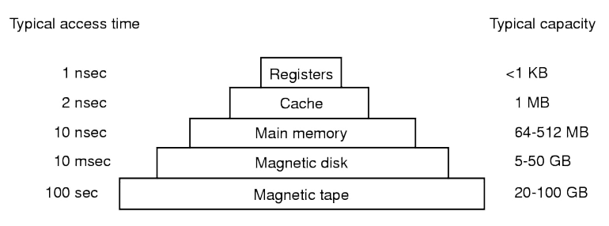
- In general, the bigger memory size is, the less speed of execution
  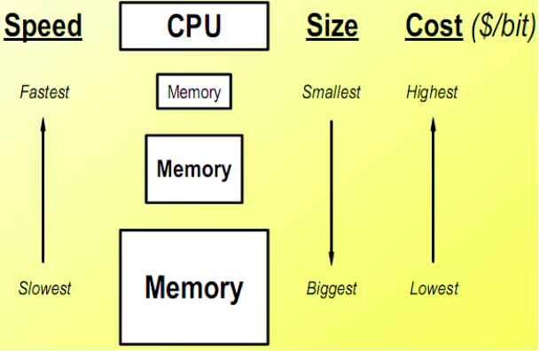

- An in-memory database is a type of purpose-built database that relies primarily on memory for data storage, in
  contrast to databases that store data on disk or SSDs.
- In-memory databases are designed to attain minimal response time by eliminating the need to access disks. Because all
  data is stored and managed exclusively in main memory, it is at risk of being lost upon a process or server failure.

- In-memory databases can persist data on disks by storing each operation in a log or by taking snapshots.

- One of the use cases of in-memory is caching.

# 3. Redis

- [Redis](https://redis.io/) (Remote Directory Server) is an open source (BSD licensed), in-memory data structure store,
  used as a database, cache, and message broker.
- Redis provides several data structures, the most popular data types such as strings, lists, hashes, sets, sorted sets
  with range queries.

## 3.1. String

- It is the simplest type of value, also is only data type in Memcached
- Set foo with string value "Hello World" and retrieving it

```
    SET foo "Hello World"
    GET foo
```

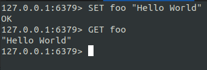

- We can set a timeout for a key, which is a limited time to live. When the time to live elapses, the key is
  automatically destroyed
- Set foo with timeout 10 seconds.

```
   EXPIRE foo 10 # if the key foo is exist
   SET foo "Hello" EX 10 # if the key foo is not exist
```

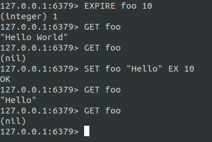

- We can perform with atomic increment.

```
    SET counter 0
    INCR counter
    INCRBY counter 10
```

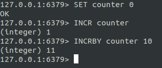

- The multiple clients issuing INCR against the same key at the same time will never enter into a race condition.

## 3.2. List

- Collections of string elements sorted according to the order of insertion (LPUSH: Left push, RPUSH: Right push). They
  are basically `linked lists`.
- If we use RPUSH and then LPOP, it will be `Queue`. On the other hand, if we use LPUSH and then LPOP, it will
  be `Stack`.

```
    RPUSH users A
    RPUSH users B
    LRANGE users 0 -1
```

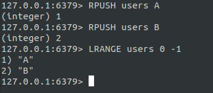

- We can `pop` elements to retrieve and eliminate value from the list

```
    RPOP users
```

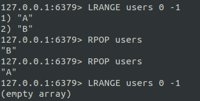

## 3.3. Hashes

- Redis hashes with field-value pairs, which are maps composed of fields associated with values. Both the field and the
  value are strings.

```
  HMSET users:1 username ntan age 21
  HGET users:1 username
  HGET users:1 age
  HGETALL users:1 
```

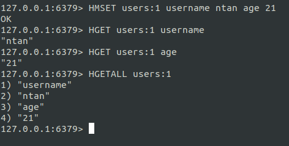

## 3.4. Sets

- Collections of unique, unsorted string elements.

```
  SADD myset 1 5 0 10
  SMEMBERS myset
```

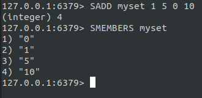

- Sets contains the unique elements, so if we insert the same value in set, it won't be successful.

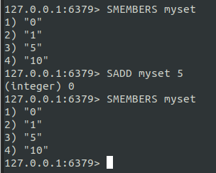

- We can use SPOP to extract a random element.

```
  SPOP myset
```

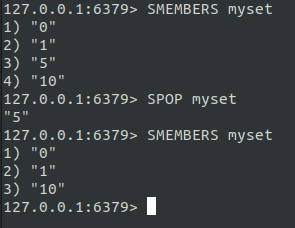

## 3.5. Sorted sets

- Similar to Sets but where every string elements is associated to a floating number value, called `score`.
- The elements are always taken sorted by their `score` according to the following rule:
    - A > B if A.score > B.score.
    - A > B if (A.score = B.score and A > B if the A string is lexicographically greater than the B string).

```
  ZADD people 1980 A
  ZADD people 1990 B
  ZADD people 2000 C
  ZADD people 2000 D
  ZADD people 1970 E
  ZRANGE people 0 -1
```

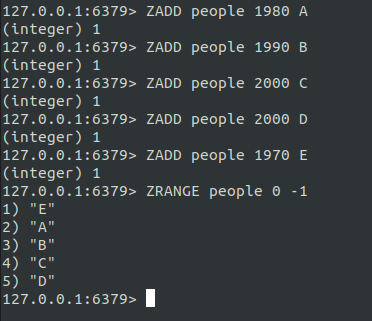

- Sorted sets are implemented via a dual-ported data structure containing both a `skip list` (insert O(log(n))) and
  a `hash table` (search O(1)).
- We can order them the opposite way. Using ZREVRANGE

```
  ZREVRANGE people 0 -1
```

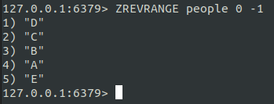

# 4. Demo Spring Boot with Redisson

- Redisson dependency

```
   <dependency>
            <groupId>org.redisson</groupId>
            <artifactId>redisson-spring-boot-starter</artifactId>
            <version>3.16.2</version>
   </dependency>
```

- Create application.yml in package resources

```yaml
redis:
  address: "redis://127.0.0.1:6379"
  ping-connection-interval: 60000
```

- Create class RedisConfig.java

```java

@Configuration
@ConfigurationProperties(prefix = "redis")
public class RedisConfig {
    private String address;
    private int pingConnectionInterval;

    @Bean(destroyMethod = "shutdown")
    public RedissonClient redissonClient() {
        Config config = new Config();

        config
                .useSingleServer()
                .setAddress(address)
                .setPingConnectionInterval(pingConnectionInterval);

        return Redisson.create(config);
    }

    public String getAddress() {
        return address;
    }

    public void setAddress(String address) {
        this.address = address;
    }

    public int getPingConnectionInterval() {
        return pingConnectionInterval;
    }

    public void setPingConnectionInterval(int pingConnectionInterval) {
        this.pingConnectionInterval = pingConnectionInterval;
    }
}
```

- Create class User.java

```java
public class User implements Serializable {
    private Long id;
    private String name;
    private Integer age;

    public User() {
    }

    public User(Long id, String name, Integer age) {
        this.id = id;
        this.name = name;
        this.age = age;
    }

    public Long getId() {
        return id;
    }

    public void setId(Long id) {
        this.id = id;
    }

    public String getName() {
        return name;
    }

    public void setName(String name) {
        this.name = name;
    }

    public Integer getAge() {
        return age;
    }

    public void setAge(Integer age) {
        this.age = age;
    }

    @Override
    public String toString() {
        return "User{" +
                "id=" + id +
                ", name='" + name + '\'' +
                ", age=" + age +
                '}';
    }
}
```

- We can use `RedisTemplate` (Spring Data Redis library) or `RedissonClient` to interact with Redis server.

## 4.1. RedisTemplate

- In this demo, we can use `StringRedisTemplate` to manipulate Redis server
- `StringRedisTemplate` using String Redis Serializer to encode/decode `UTF8`. We can see source code of it.

```java
public class StringRedisTemplate extends RedisTemplate<String, String> {
    public StringRedisTemplate() {
        this.setKeySerializer(RedisSerializer.string());
        this.setValueSerializer(RedisSerializer.string());
        this.setHashKeySerializer(RedisSerializer.string());
        this.setHashValueSerializer(RedisSerializer.string());
    }

    public StringRedisTemplate(RedisConnectionFactory connectionFactory) {
        this();
        this.setConnectionFactory(connectionFactory);
        this.afterPropertiesSet();
    }

    protected RedisConnection preProcessConnection(RedisConnection connection, boolean existingConnection) {
        return new DefaultStringRedisConnection(connection);
    }
}
```

```java
public interface RedisSerializer<T> {
    @Nullable
    byte[] serialize(@Nullable T var1) throws SerializationException;

    @Nullable
    T deserialize(@Nullable byte[] var1) throws SerializationException;

    static RedisSerializer<Object> java() {
        return java((ClassLoader) null);
    }

    static RedisSerializer<Object> java(@Nullable ClassLoader classLoader) {
        return new JdkSerializationRedisSerializer(classLoader);
    }

    static RedisSerializer<Object> json() {
        return new GenericJackson2JsonRedisSerializer();
    }

    static RedisSerializer<String> string() {
        return StringRedisSerializer.UTF_8;
    }

    static RedisSerializer<byte[]> byteArray() {
        return ByteArrayRedisSerializer.INSTANCE;
    }

    default boolean canSerialize(Class<?> type) {
        return ClassUtils.isAssignable(this.getTargetType(), type);
    }

    default Class<?> getTargetType() {
        return Object.class;
    }
}
```

- As we can see, `RedisSerializer` uses StringRedisSerializer.UTF_8 to encode/decode key-value.
- There are many Serializers such as `JdkSerializationRedisSerialzer` (default for `RedisTemplate`)
  , `GenericJackson2JsonRedisSerializer`, `Jackson2JsonRedisSerializer` (read/write using `Jackson's ObjectMapper`)
  , `OxmSerializer`, `Kryo`, ...
- By default, `RedisTemplate` using `JdkSerializationRedisSerializer` for encode/decode key-value.

```java
public class RedisTemplate<K, V> extends RedisAccessor implements RedisOperations<K, V>, BeanClassLoaderAware {
    // ...

    public void afterPropertiesSet() {
        super.afterPropertiesSet();
        boolean defaultUsed = false;
        if (this.defaultSerializer == null) {
            this.defaultSerializer = new JdkSerializationRedisSerializer(this.classLoader != null ? this.classLoader : this.getClass().getClassLoader());
        }

        // ...

    }

    // ...
}
```

- It's good enough for encode/decode Java Object.
- In microservices, however, service A want to get data which is inserted to redis server by service B, it's hard to
  decode value because of `JdkSerializationRedisSerializer`'s encode/decode.
- For example, we use `RedisTemplate<String, Object>` to set data object `User` into redis.
- In order to use `RedisTemplate`, we have to create bean for it in class `RedisConfig.java`

```java

public class RedisConfig {
    // ...

    @Bean
    public RedisTemplate<String, Object> redisTemplate() {
        RedisTemplate<String, Object> redisTemplate = new RedisTemplate<>();
        redisTemplate.setConnectionFactory(new RedissonConnectionFactory(
                redissonClient()
        ));

        redisTemplate.setHashKeySerializer(RedisSerializer.string());
        redisTemplate.setKeySerializer(RedisSerializer.string());

        redisTemplate.setEnableTransactionSupport(true);
        redisTemplate.afterPropertiesSet();
        return redisTemplate;
    }

    // ...
}
```

- After create bean, now we can use it for manipulating data.

```java

@SpringBootApplication
public class RedissonSpringApplication {
    public static void main(String[] args) {
        SpringApplication.run(RedissonSpringApplication.class, args);
    }

    @Bean
    public CommandLineRunner run(RedisTemplate<String, Object> redisTemplate) {
        return args -> {
            redisTemplate.boundHashOps("users:1").put("1", new User(1L, "An1", 21));
            User user1 = (User) redisTemplate.boundHashOps("users:1").get("1");
            System.out.println(user1);
        };
    }
}
```

- After running, we can see the result in the console

  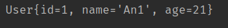

- But when go to redis server and look at the data `user1` that we have stored, it will be look like this.

  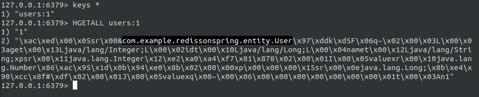

- What I am highlighting is the package of the project `com.example.redissonspring.entity.User` (My project name is
  redisson-spring).
- With this data is stored, then other services with different package cannot retrieve data because it cannot be
  deserialized with the same package.
- Because of this reason, we will use different approaches like using `Gson` or `JacksonJson` to encode/decode the data.

```java
public final class GsonUtils {
    private static final Gson GSON =
            new GsonBuilder()
                    .registerTypeAdapter(
                            byte[].class,
                            new TypeAdapter<byte[]>() {
                                @Override
                                public void write(JsonWriter out, byte[] value) throws IOException {
                                    out.value(Base64.getEncoder().encodeToString(value));
                                }

                                @Override
                                public byte[] read(JsonReader in) throws IOException {
                                    return Base64.getDecoder().decode(in.nextString());
                                }
                            })
                    .create();

    public static <T> T fromJson(String json, Class<T> clazz) {
        return GSON.fromJson(json, clazz);
    }

    public static String toJson(Object obj) {
        return GSON.toJson(obj);
    }
}
```

```java
public final class JacksonUtils {
    private static final ObjectMapper OM = new ObjectMapper();

    public static <T> T fromJson(String json, Class<T> clazz) throws JsonProcessingException {
        return OM.readValue(json, clazz);
    }

    public static String toJson(Object obj) throws JsonProcessingException {
        return OM.writeValueAsString(obj);
    }
}

```

```java

@SpringBootApplication
public class RedissonSpringApplication {
    public static void main(String[] args) {
        SpringApplication.run(RedissonSpringApplication.class, args);
    }

    @Bean
    public CommandLineRunner run(StringRedisTemplate redisTemplate) {
        return args -> {
            final String PREFIX_KEY = "users";

            String userId1 = "1";
            String userId2 = "2";

            // users
            ObjectMapper om = new ObjectMapper();
            redisTemplate.boundHashOps(PREFIX_KEY + ":" + userId1).put(userId1, JacksonUtils.toJson(new User(1L, "An1", 21)));
            redisTemplate.boundHashOps(PREFIX_KEY + ":" + userId2).put(userId2, GsonUtils.toJson(new User(2L, "An2", 21)));

            // get user in key users:1 with deserialize using JacksonJson
            User user1 = JacksonUtils.fromJson((String) redisTemplate.boundHashOps(PREFIX_KEY + ":" + userId1).get(userId1), User.class);
            System.out.println(PREFIX_KEY + "-> " + user1);

            // get user in key users:2 with deserialize using Gson
            User user2 = GsonUtils.fromJson((String) redisTemplate.boundHashOps(PREFIX_KEY + ":" + userId2).get(userId2), User.class);
            System.out.println(PREFIX_KEY + "-> " + user2);
        };
    }
}
```

- Result after running

  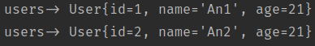

- Look at the data stored in redis server

  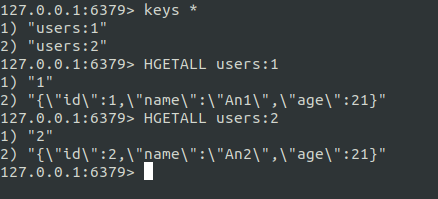

## 4.2. RedissonClient

```java

@SpringBootApplication
public class RedissonSpringApplication {
    public static void main(String[] args) {
        SpringApplication.run(RedissonSpringApplication.class, args);
    }

    @Bean
    public CommandLineRunner run(RedissonClient redissonClient) {
        return args -> {
            final String PREFIX_KEY = "users";

            String userId1 = "1";
            String userId2 = "2";
            String userId3 = "3";
            String userId4 = "4";

            // Hash
            redissonClient
                    .getMap(PREFIX_KEY + ":" + userId1)
                    .fastPut(userId1,
                            GsonUtils.toJson(
                                    new User(1L, "An1", 21)
                            )
                    );
            User user1 = GsonUtils.fromJson(
                    (String) redissonClient
                            .getMap(PREFIX_KEY + ":" + userId1)
                            .get(userId1),
                    User.class
            );
            System.out.println(PREFIX_KEY + "-> " + user1);

            // Hash eviction after 10 seconds
            redissonClient
                    .getMapCache(PREFIX_KEY + ":" + userId2)
                    .fastPut(userId2,
                            GsonUtils.toJson(
                                    new User(2L, "An2", 21)
                            ),
                            10,
                            TimeUnit.SECONDS
                    );
            User user2 = GsonUtils.fromJson(
                    (String) redissonClient
                            .getMapCache(PREFIX_KEY + ":" + userId2)
                            .get(userId2),
                    User.class
            );
            System.out.println(PREFIX_KEY + "-> " + user2);

            // Value string
            redissonClient
                    .getBucket(PREFIX_KEY + ":" + userId3)
                    .set(
                            GsonUtils.toJson(
                                    new User(3L, "An3", 21)
                            )
                    );
            User user3 = GsonUtils.fromJson(
                    (String) redissonClient
                            .getBucket(PREFIX_KEY + ":" + userId3)
                            .get(),
                    User.class
            );
            System.out.println(PREFIX_KEY + "-> " + user3);

            // Value string eviction after 10 seconds
            redissonClient
                    .getBucket(PREFIX_KEY + ":" + userId4)
                    .set(
                            GsonUtils.toJson(
                                    new User(4L, "An3", 21)
                            ),
                            10,
                            TimeUnit.SECONDS
                    );
            User user4 = GsonUtils.fromJson(
                    (String) redissonClient
                            .getBucket(PREFIX_KEY + ":" + userId4)
                            .get(),
                    User.class
            );
            System.out.println(PREFIX_KEY + "-> " + user4);
        };
    }
}

```

- Result after running.

  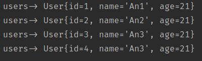

- After 10 seconds, we will look at the data in redis server.

  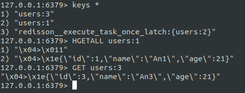